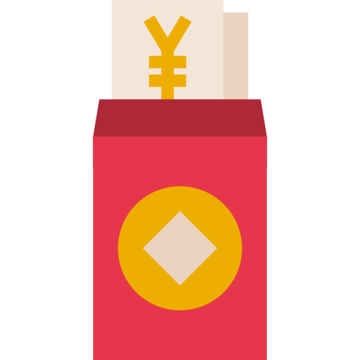

# [ETHCC Paris -  RedEnvelope](https://heartfelt-dieffenbachia-195a58.netlify.app/)

  

 

  

 

## 💬 **About the project**

Red Packet aims to gamify and make it easier to send gifts to their friends and family. It will also create a network effect and onboard the next billion people to web3 and blockchain. We are a multichain project and currently live on Polygon Mumbai, Celo, Cronos, Gnosis, Neon, and Ethereum. 

> **Multichain**, We have an agnostic deployment solution and with few commands the smart contract is deployed in different blockchain and frontend automatically reads the right contract address by blokchain.

> **FullStack Repo**, This repo includes both frontEnd and smart contracts files all together. It has a project structure facilitating a fast/clean integration and collaboration between backEnd and frontEnd team.

 

## 🚀 **Onboarding**

You will need a Windows, Mac or Linux computer with command line access and permission to install new system packages. An active Internet connection is required to install the following required software:

- Node https://nodejs.org/en/
- NPM https://www.npmjs.com/
- Yarn https://yarnpkg.com/

To initialize the project, using the terminal, navigate to the folder containing the project and run the `yarn install` command. This will install all the necessary packages and prepare your project for local development. Then you can use `yarn dev`
 

## 📄 **Smart Contracts Inventory**

| Contract          | Network | Testnet Address                            |
| :--------------------- | :------ | :----------------------------------------- |
| RedEnvelope            | Neon    | neonscan.org/address/0x8487D75c74dcAaF05a8cDf5EF1a27BbB59028D9e#contract       |
| RedEnvelope            | Polygon | mumbai.polygonscan.com/address/0x2490015d3937277Cd2826705a971d5ef4cB0be9f#code | 
| RedEnvelope            | CELO    | alfajores-blockscout.celo-testnet.org/address/0xd94B99d4666920dfFa1dF3d89F4B34024003FE4e/contracts | 
| RedEnvelope            | Gnosis | blockscout.com/xdai/optimism/address/0x4a75774E1308BFB81C70F79eC5A2E04985FeF5Bf/contracts#address-tabs                                      | 
| RedEnvelope            | Cronos | testnet.cronoscan.com/address/0xDC57f9E61d8E3D61b4cC2B94793aF5C2E2cd8A24#code                                      |
| RedEnvelope            | Ethereum | rinkeby.etherscan.io/address/0x99E6b21Dfb5eB7768158cfc66133A1791C4A98aC#code |

 

## 📓 **Additional Notes**

**Commit Standard**. The project aims to standardize commits as much as possible, therefore we invite you to use the [Conventional Commits](https://www.conventionalcommits.org/en/v1.0.0/) specification.

 

We have used the following frameworks:

* Truffle
* Ganache
* Infura
* Solidity
* vue.js

The multichain solution is available in the following blockchains:

* Celo
* Neon
* Cronos
* Gnosis
* Polygon
* Rinkeby

 

## 💻 **Browser Support**

Currently, we aim to support the latest two versions of the following browsers:

    

